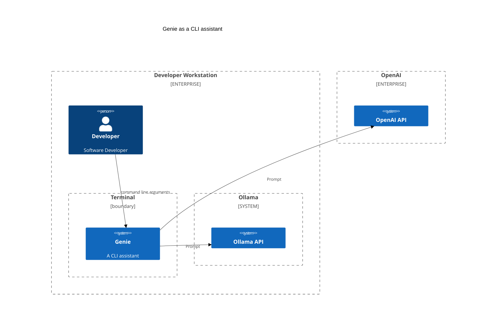
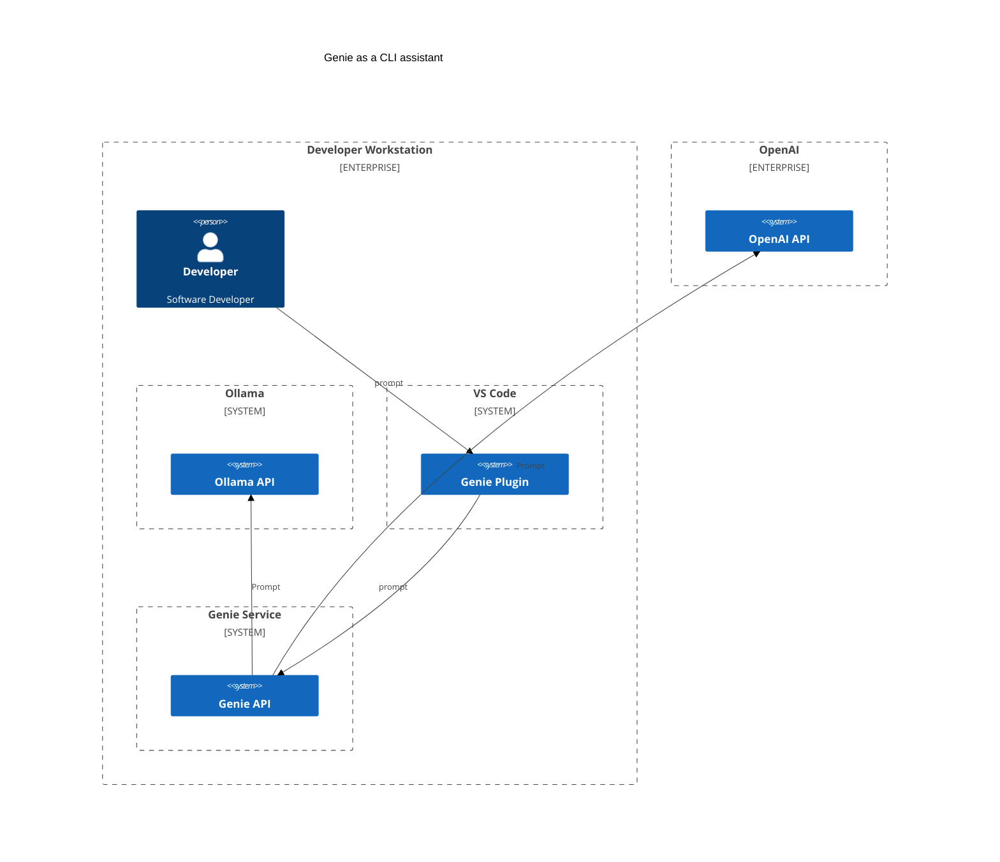

# Genie a rust cli for interacting with LLMs

[](https://www.repostatus.org/#concept)

## Description

Genie is a Large Language Model (LLM) based command line application written in Rust.

Genie allows users to interact with the ChatGPT API, Ollama for AI operations. Genie can be built into larger scripted
applications in the usual Unix way by piping input into the app and output into other apps.

For more complex tasks, Genie can run scripts written in YAML.

If you do a quick search of the internet or GitHub for projects that are using ChatGPT in some way, you will find quite a
few.
Many use interpreted languages and need your system to be set up to use the toolchain and dependencies.
genie is written in rust.
A key goal of the project is to make it super easy to install. Typically, download a single binary and you're done. (except for the small dependency on an OpenAI application key)

As a cli the application can accept input from other tools.

* [User Guide](doc/index.md)
* [Script Examples](examples/README.md)

```bash
git log HEAD~2 | genie Summarize as a release note
```

### Project build and release status

 

## Installing

Check out instructions under releases. 

## Building

### Prerequisites

- Rust stable https://www.rust-lang.org/tools/install or via rustup https://rustup.rs

You will also need a ChatGPT API key. You can get one from https://openai.com and then set it as an environment variable.

```bash
export OPENAI_API_KEY=<your key>
```

## Building

### Prerequisites

- Rust stable https://www.rust-lang.org/tools/install

Clone the repository and run the tests

```bash
cargo test
```

Build the application

```bash
cargo build --release
```

add the binary `target/release/genie` to your path or copy to a directory that is already on your path.

## Genie in action

### Summarize for a git commit

The following summarizes changes and commits those changes.

```bash
git diff | genie Summarize changes as a git commit message. | git commit -a -F -
```

OR using a local mistral model through Ollama

```bash
git diff | genie --model ollama::mistral  Summarize changes as a git commit message. | git commit -a -F -
```

Which is a little long-winded, so you can create an alias in your shell.

```bash
alias gcommit="git diff | genie --model ollama::mistral Summarize changes as a git commit message. | git commit -a -F -"
```

## Architecture

Running as a CLI application in the terminal



Supporting IDE plugins



## Making a release

The release process is automated using GitHub actions. The release process is triggered by creating a release in GitHub.

```bash
sh make-release.sh -b <bump-type>
```

Where `<bump-type>` is one of `major`, `minor`, `patch`.

## Inspiration

This project was inspired by the follow and the desire to learn Rust.

https://github.com/TheR1D/shell_gpt