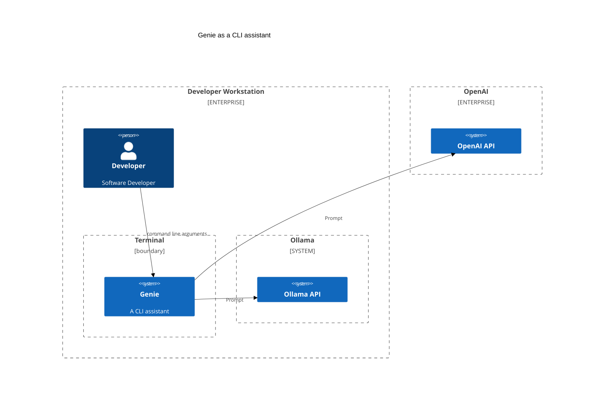
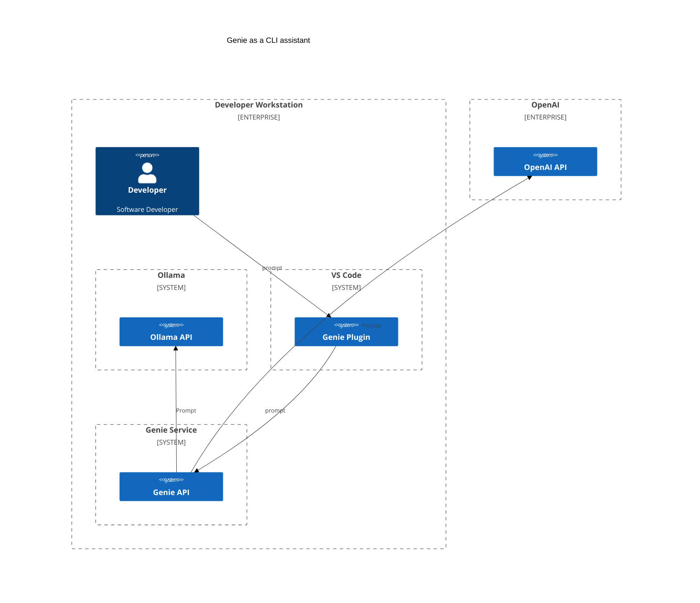

# Genie a rust cli for interacting with ChatGPT

[](https://www.repostatus.org/#concept)

## Description

This is a ChatGPT CLI application written in Rust.
The application allows users to interact with the ChatGPT API for AI text generation within their terminal.

If you do a quick search of the internet or GitHub for projects that are using ChatGPT in some way you will find quite a
few.
Many use interpreted languages and need your system to be setup to use the toolchain and dependencies.
genie is written in rust.
A key goal of the project is to make it super easy to install. Typically download a single binary and you're done. (
except fo the small dependency on an OpenAI application key)

As a cli the application can accept input from other tools.

* [User Guide](doc/index.md)
* [Script Examples](examples/README.md)

```bash
git log HEAD~2 | genie Summarize as a release note
```

### Project build and release status

  

## Installing

### Prerequisites

- Rust stable https://www.rust-lang.org/tools/install or via rustup https://rustup.rs

You will also need a ChatGPT API key. You can get one from https://openai.com and then set it as an environment
variable.

```bash
export OPENAI_API_KEY=<your key>
```

### Install from crates.io

```bash
cargo install genie
````

## Building

### Prerequisites

- Rust stable https://www.rust-lang.org/tools/install

Clone the repository and run the tests

```bash
cargo test
```

Build the application

```bash
cargo build --release
```

add the binary `target/release/genie` to your path or copy to a directory that is already on your path.

### Summarize for a git commit

The following summarizes changes and commits those changes.

```bash
git diff | genie Summarize changes as a git commit message. | git commit -a -F -
```

OR

```bash
git diff | genie --model ollama::mistral  Summarize changes as a git commit message. | git commit -a -F -
```

Which is a little long-winded, so you can create an alias in your shell.

```bash
alias gcommit="git diff | genie --model ollama::mistral Summarize changes as a git commit message. | git commit -a -F -"
```

## Repository maintenance

Currently, repository maintenance is manual and run semi regularly.

### Updating the rust toolchain

```bash
rustup update
```

### Updating dependencies

The following command will update the Cargo.lock file with the latest versions of dependencies.

```bash
cargo update
```

## Architecture

Running as a CLI application in the terminal



Supporting IDE plugins



## Inspiration

This project was inspired by the follow and the desire to learn Rust.

https://github.com/TheR1D/shell_gpt